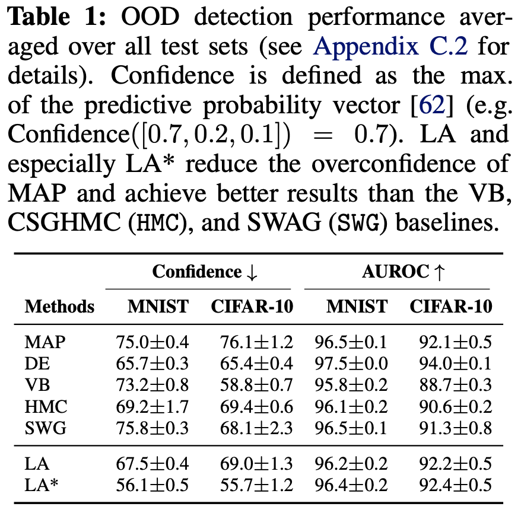

# Laplace Redux – Effortless Bayesian Deep Learning

*(Your table of contributors will go here)*

## Introduction

The paper "Laplace Redux – Effortless Bayesian Deep Learning" \[1\] makes a compelling case for the Laplace Approximation (LA) as a practical and efficient method for uncertainty quantification in deep learning. The authors argue against common misconceptions that LA is expensive or yields inferior results, demonstrating that it is competitive with popular alternatives like deep ensembles and variational Bayes, often at a significantly lower computational cost. A key contribution of their work is the introduction of `laplace`, a user-friendly PyTorch library designed to make LA accessible to practitioners.

The Laplace Approximation (LA) is a post-hoc technique, meaning it takes a trained network (a MAP estimate, $\theta_{MAP}$) and fits a Gaussian distribution around its parameters to capture uncertainty. A crucial choice is deciding *which* parameters to include in this probabilistic treatment. The paper primarily discusses two alternatives:

- **Full Laplace**: This is the most direct application, where the approximation is applied to *all* weights of the neural network. While this provides a posterior over the entire parameter space $\theta$, computing the full Hessian matrix, which is of size $D \times D$, where $D$ is the total number of parameters, is often computationally infeasible for modern deep neural networks. This approach, therefore, typically relies on structural approximations of the Hessian itself, like a diagonal or Kronecker-factored (KFAC) structure, to remain tractable.
- **Last-Layer Laplace (LLLA)**: To drastically improve scalability, the paper highlights the *last-layer LA* as a highly effective and cost-efficient alternative. LLLA is a special case of subnetwork inference where only the weights of the final layer, $\theta_{last}$, are treated probabilistically. The preceding layers of the network are viewed as a fixed, deterministic feature extractor with their weights frozen at the MAP estimate. Since the number of parameters in the last layer is significantly smaller than in the full network, computing the corresponding Hessian is much cheaper, allowing for more expressive structures (like a full covariance over the last-layer weights) with minimal overhead.

This distinction represents a key trade-off between the scope of the Bayesian treatment and its computational feasibility, with last-layer LA emerging as the most powerful and practical choice. The authors' experiments show that this simplified approach is not only more efficient but often leads to better performance, as it is less prone to underfitting than a full LA applied post-hoc.

Our project aims to reproduce and extend the findings of this paper. Our primary goal is to reproduce the out-of-distribution (OOD) detection results presented in **Table 1** of the paper:

Using the authors' public codebase for the [algorithms(https://github.com/aleximmer/Laplace) and [experiments](https://github.com/runame/laplace-redux), we verify the reported performance and then extend the code and experiment pipeline through four distinct contributions, one for each team member:

- Implementing and evaluating a **new algorithm variant** (`SubspaceLaplace`).
- Implementing and evaluating a **second new algorithm variant** (`SwagLaplace`).
- Evaluating the original and new methods on **new datasets**.
- Conducting a **hyperparameter sensitivity analysis**.

This blog post details our methodology and presents our findings, ultimately assessing the claims of the original paper and the value of our extensions.

## Methodology

We began by collectively connecting the two cobebases together, as this did not work out-of-the-box and required many import fixes. Additionally, we had to adapt their training scripts to handle correctly both algorithm variants that we proposed.
Our individual components and extension efforts are broken down into the following components.

### New Algorithm Variant: Subspace Laplace

The paper explores several methods to make the LA scalable, such as using Kronecker-factored (KFAC) or diagonal approximations of the Hessian. These methods simplify the covariance structure across all parameters. Our work introduces a different approach: **Subspace Laplace**.

The motivation for this variant comes from the observation that the posterior distribution of deep neural networks often has a low *effective dimensionality*. This means that most of the variation in the model's output can be explained by changes along just a few directions in the high-dimensional parameter space. Instead of approximating a simplified covariance over all parameters, Subspace Laplace approximates the **full covariance** within a small, carefully chosen low-dimensional subspace. This subspace is defined by the directions of highest curvature (i.e., the top eigenvectors of the Hessian), which are assumed to be the most informative for uncertainty. While the original paper mentions subspace inference in its related work, it does not implement or benchmark this specific variant, making it a natural and interesting extension.

The Subspace Laplace algorithm works as follows:

1. **Find MAP:** First, a standard Maximum a Posteriori (MAP) estimate of the model's weights ($\theta_{MAP}$) is found, which is equivalent to normal network training.
2. **Identify Subspace:** An efficient algorithm (stochastic power iteration) is used to find the top $K$ eigenvectors of the loss curvature (Hessian). These eigenvectors form an orthonormal basis $U$ for a $K$-dimensional subspace of the full parameter space.
3. **Project and Fit:** The Hessian is projected into this subspace, resulting in a small $K \times K$ matrix: $H_{sub} = U^T H U$. This is done efficiently using Hessian-vector products, avoiding the need to ever compute the full Hessian. The posterior precision in the subspace is then computed as $P_{sub} = H_{sub} + \lambda I_K$, where $\lambda$ is the prior precision.
4. **Inference:** To make predictions or estimate uncertainty, we sample from this low-dimensional Gaussian distribution and project the samples back into the full parameter space: $\theta_{sample} = \theta_{MAP} + U z$, where $z$ is a sample drawn from $\mathcal{N}(0, P_{sub}^{-1})$. This allows us to capture the most critical uncertainty information at a fraction of the full-rank cost.

### New Algorithm Variant: SwagLaplace

### Evaluating on New Datasets

### Hyperparameter Sensitivity Analysis

## Experiments and Discussion

The core experiment we aim to reproduce is the out-of-distribution (OOD) detection benchmark detailed in Table 1 of the original paper. This experiment evaluates a model's ability to recognize when an input is from a different dataset than the one it was trained on. An ideal, trustworthy model should recognize when it is presented with something unfamiliar. Instead of making a confident (and likely incorrect) prediction, it should signal its uncertainty.
The paper defines confidence as the maximum value of the predictive probability vector. For example, if a model predicts probabilities of [0.7, 0.2, 0.1] for three classes, its confidence is 0.7 \[1\].
The original experiment trains models on CIFAR-10 and MNIST and measures their *confidence* and *AUROC* scores on various OOD samples.

**more information about the baselines**

### Reproduction of Table 1

We began by replicating their baseline results. Our findings confirm the paper's claims, as we were able to reproduce the reported metrics with only marginal differences, typically within a $1-2%$ margin. These minor variations are expected due to differences in hardware and software environments. We decided to include *run time* as a metric in the tables, in order additionally to compare the performance of the new algorithm variants w.r.t. the *vanilla* laplace method.

- MINST-OOD Table:

| Method             | Confidence   | AUROC    | Test time (s)   |
|:-------------------|:-------------|:---------|:----------------|
| MAP                | 75.0±0.6     | 96.5±0.2 | 0.64±0.01       |
| DE                 | 65.7±0.5     | 97.5±0.0 | 0.68±0.05       |
| VB                 | 73.3±1.4     | 95.9±0.3 | 1.76±0.01       |
| HMC                | 69.2±3.2     | 96.1±0.3 | 0.66±0.01       |
| SWG                | 76.8±0.0     | 96.3±0.0 | 1.25±0.0        |
|:------------------:|:------------:|:--------:|:---------------:|
| LA                 | nan±nan      | nan±nan  | nan±nan         |
| LA*                | 43.1±0.9     | 95.7±0.4 | 0.68±0.04       |
| SUBSPACE LA        | 68.2±0.0     | 95.8±0.0 | 55.91±0.0       |
| SWAG LA            | 11.8±0.0     | 95.9±0.0 | 56.37±0.0       |

### Extension 1: Subspace Laplace Results

### Extension 2: SwagLaplace Results

### Extension 3: Results on New Datasets

### Extension 4: Hyperparameter Sensitivity Results

## Conclusion

## References

\[1\] E. Daxberger, A. Kristiadi, A. Immer, R. Eschenhagen, M. Bauer, and P. Hennig, "Laplace Redux – Effortless Bayesian Deep Learning," in *Advances in Neural Information Processing Systems*, 2021.
